<p align="center">
  
</p>

<h1 align="center">Questly</h1>

<p align="center">
  <strong>Real-World Bounties. On-Chain Rewards.</strong>
</p>

<p align="center">
  A Web3 bounty platform where users post location-based tasks, claim quests, submit proof of completion, and earn ALGO — secured by smart contract escrow on the Algorand blockchain.
</p>

<br />

<p align="center">
  
  
  
  
  
  
  
  
  
  
  
  
</p>

<p align="center">
  <a href="https://questly.anskservices.com">Landing</a>
  &nbsp;&middot;&nbsp;
  <a href="https://apk.anskservices.com/health">API Status</a>
  &nbsp;&middot;&nbsp;
  <a href="#architecture">Architecture</a>
  &nbsp;&middot;&nbsp;
  <a href="#getting-started">Get Started</a>
</p>

<br />

---

<br />

## Overview

Questly bridges the gap between digital bounties and real-world task completion. Built for the AceHack hackathon, it combines a mobile-first Flutter application with a production-grade Node.js backend and Algorand blockchain integration.

**Core premise:** A user posts a bounty (e.g., "Photograph this mural", "Deliver groceries to this address") with a location pin and an ALGO reward locked in escrow. Other users discover nearby bounties on an interactive map, claim them, complete the task in the real world, submit photo/document proof, and receive instant on-chain payment once the bounty creator approves.

<br />

---

## Screenshots

<table>
  <tr>
    <td align="center">
      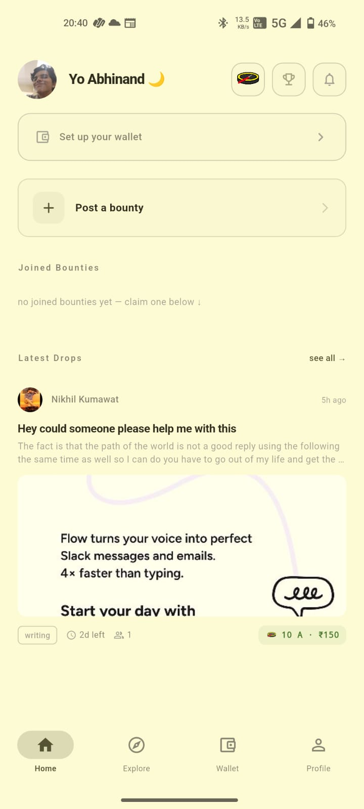
      <br /><sub><b>Login</b></sub>
    </td>
    <td align="center">
      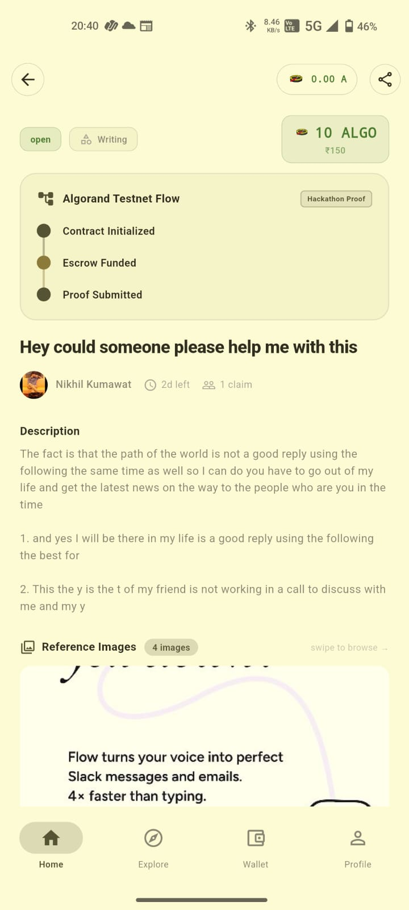
      <br /><sub><b>Register</b></sub>
    </td>
    <td align="center">
      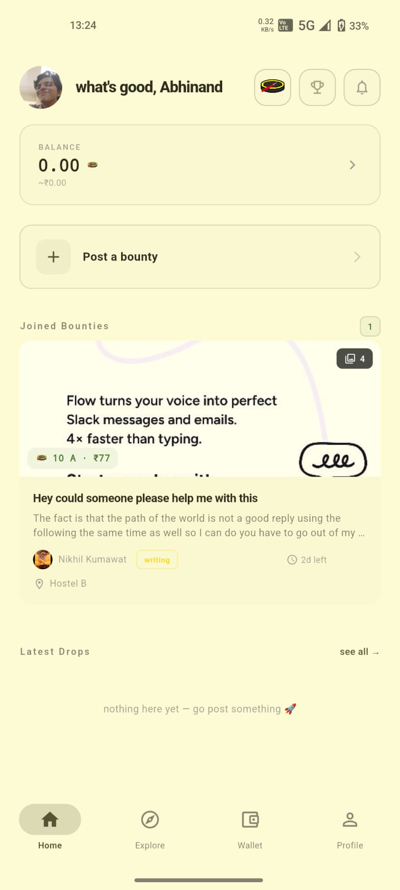
      <br /><sub><b>Home Dashboard</b></sub>
    </td>
    <td align="center">
      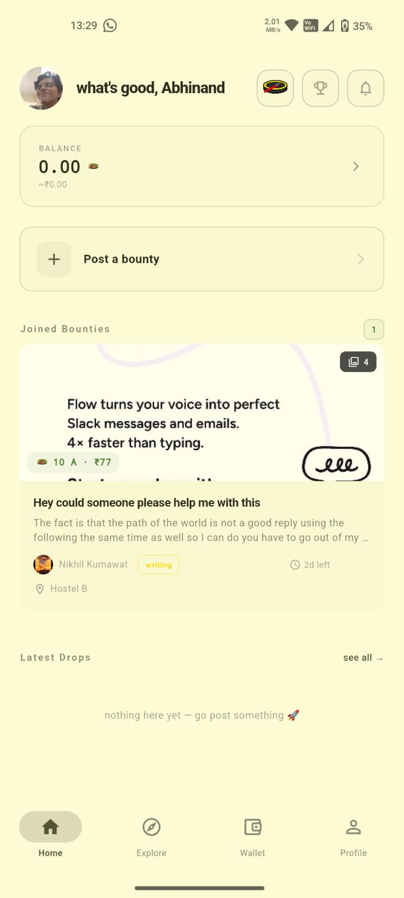
      <br /><sub><b>Explore Map</b></sub>
    </td>
  </tr>
  <tr>
    <td align="center">
      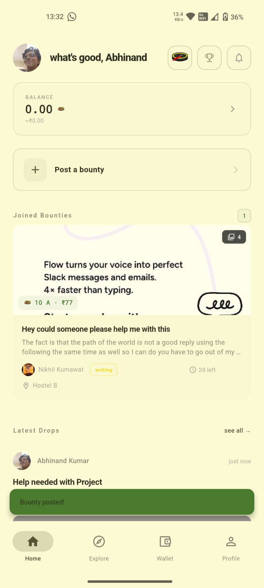
      <br /><sub><b>Bounty Detail</b></sub>
    </td>
    <td align="center">
      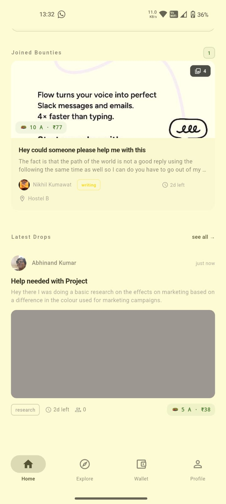
      <br /><sub><b>Create Bounty</b></sub>
    </td>
    <td align="center">
      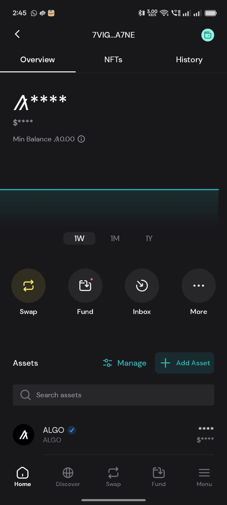
      <br /><sub><b>Wallet</b></sub>
    </td>
    <td align="center">
      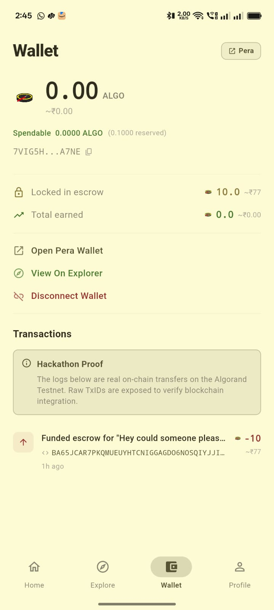
      <br /><sub><b>Pera Wallet Connect</b></sub>
    </td>
  </tr>
  <tr>
    <td align="center">
      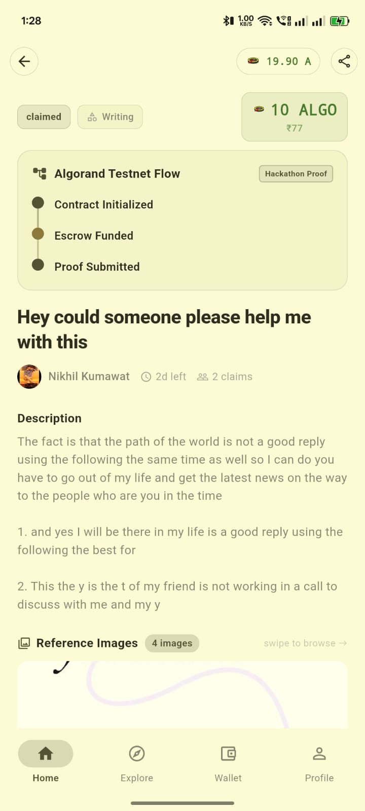
      <br /><sub><b>Profile</b></sub>
    </td>
    <td align="center">
      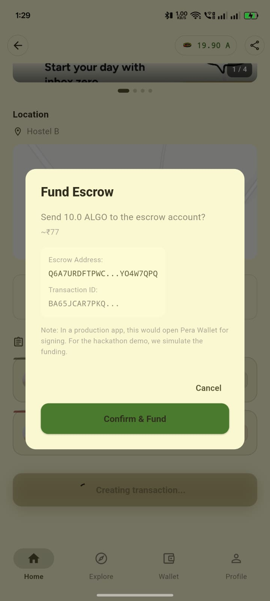
      <br /><sub><b>Leaderboard</b></sub>
    </td>
    <td align="center">
      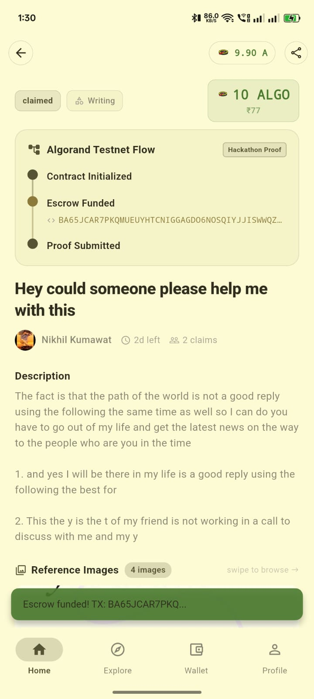
      <br /><sub><b>Settings</b></sub>
    </td>
    <td align="center"></td>
  </tr>
</table>

<br />

---

<br />

## Key Features

### Bounty System
- Post bounties with descriptions, deadlines, ALGO rewards, and GPS coordinates
- Multi-image uploads per bounty (up to 10)
- Full lifecycle management: Open, Claimed, In Review, Completed, Cancelled
- Proof-of-completion submission with photo/document uploads

### Algorand Escrow
- ALGO rewards locked in escrow on bounty creation
- On-chain verification of funding transactions
- Automatic release to claimer on approval
- Automatic refund to creator on cancellation
- Custodial wallet generation for new users
- Devmode faucet for testnet funding (up to 1000 ALGO)

### Gamification
- XP awarded for completing bounties, posting tasks, submitting proof, and receiving reviews
- Level progression using a square-root curve
- Rank tiers inspired by Minecraft: Wood, Stone, Iron, Gold, Diamond, Netherite
- Global leaderboard with server-side caching
- Inactivity decay to keep the ecosystem active

### Authentication
- Email/password registration with bcrypt hashing
- Google OAuth 2.0 (web redirect + mobile ID token flow)
- GitHub OAuth 2.0
- JWT access tokens (7d) + refresh token rotation (30d)
- Multi-step onboarding: name, skills, location

### Map-Based Discovery
- Interactive map powered by flutter_map + OpenStreetMap
- GPS-based bounty filtering for nearby tasks
- Real-time location tracking via geolocator

### Reviews and Disputes
- 1-5 star rating system after bounty completion
- Dispute filing on rejected claims
- Admin resolution workflow

<br />

## Architecture

```
                                    HTTPS (Traefik + Let's Encrypt)
                                              |
                     +------------------------+------------------------+
                     |                                                 |
            apk.anskservices.com                          questly.anskservices.com
                     |                                                 |
              +------+------+                                   +------+------+
              |  Express 5  |                                   |  Next.js 16 |
              |   API :4000 |                                   | Landing:3020|
              +------+------+                                   +-------------+
                     |
       +-------------+-------------+-------------+
       |             |             |             |
  +----+----+  +-----+-----+ +----+----+  +-----+-----+
  |PostgreSQL|  |   MinIO   | | Algorand|  |  Flutter  |
  |  :5432   |  | S3 :9000  | |  Devmode|  | Mobile App|
  +---------+  +-----------+ | :4001   |  +-----------+
                              | :4002   |
                              | :8980   |
                              +---------+
```

| Component | Technology | Purpose |
|:----------|:-----------|:--------|
| Mobile App | Flutter 3 / Dart | Cross-platform mobile client |
| API Server | Node.js + Express 5 + TypeScript | REST API with JWT auth |
| ORM | Prisma 7 | Type-safe database access with migrations |
| Database | PostgreSQL 16 | Persistent data store |
| Object Storage | MinIO | S3-compatible file storage for images and proof |
| Blockchain | Algorand SDK 3.5 + Devmode Sandbox | Escrow payments, wallet management |
| Landing Page | Next.js 16 + React 19 | Marketing site with React Compiler |
| Reverse Proxy | Traefik v3 (via Coolify) | TLS termination, routing, Let's Encrypt |
| Containerization | Docker Compose | Multi-service orchestration |

<br />

## Database Schema

12 models with composite indexes for optimized query performance.

```
User ──< Account            (OAuth providers)
  |──< RefreshToken         (JWT rotation)
  |──< Quest ──< Task       (personal task tracker)
  |──< Upload               (file metadata)
  |──< Bounty ──< BountyClaim ──< Dispute
  |──< WalletTransaction    (on-chain tx history)
  |──< Review (given)
  |──< Review (received)
```

**Bounty lifecycle states:** `OPEN` > `CLAIMED` > `IN_REVIEW` > `COMPLETED` | `CANCELLED`

**Escrow states:** `UNFUNDED` > `FUNDED` > `RELEASED` | `REFUNDED`

**Claim states:** `PENDING` > `ACTIVE` > `SUBMITTED` > `APPROVED` | `REJECTED`

<br />

## Algorand Integration

Questly uses the Algorand blockchain for trustless bounty payments. The entire payment flow is handled via an escrow account managed by the backend.

```
Creator                    Escrow                     Claimer
   |                         |                          |
   |-- Fund Bounty (ALGO) -->|                          |
   |                         |                          |
   |                         |      Claim + Complete    |
   |                         |<--- Submit Proof --------|
   |                         |                          |
   |--- Approve Claim ------>|                          |
   |                         |--- Release ALGO -------->|
   |                         |                          |
```

**On cancellation (before approval):**

```
Creator                    Escrow
   |                         |
   |--- Cancel Bounty ------>|
   |<-- Refund ALGO ---------|
   |                         |
```

**SDK operations:**
- `algosdk.Algodv2` for transaction submission and status queries
- `algosdk.Kmd` for devmode key management and faucet dispensing
- Unsigned transaction construction for client-side signing
- Server-side custodial signing for automated flows
- `waitForConfirmation` for reliable transaction finality

<br />

## Gamification System

| Action | XP |
|:-------|---:|
| Complete a bounty | +100 |
| Post a bounty | +20 |
| Submit proof | +10 |
| 5-star review received | +50 |
| 4-star review received | +25 |
| Cancel after claim | -20 |
| 1-star review received | -30 |
| Inactivity (3+ days idle) | -10/day |

**Level formula:** `level = floor(sqrt(xp / 25))`

| Rank | Min XP | Level |
|:-----|-------:|------:|
| Wood | 0 | 0 |
| Stone | 500 | 4 |
| Iron | 1,500 | 7 |
| Gold | 4,000 | 12 |
| Diamond | 10,000 | 20 |
| Netherite | 25,000 | 31 |

<br />

## API Reference

Base URL: `https://apk.anskservices.com/api/v1`

| Method | Endpoint | Description |
|:-------|:---------|:------------|
| `POST` | `/auth/register` | Create account (email + password) |
| `POST` | `/auth/login` | Authenticate and receive tokens |
| `POST` | `/auth/google` | Google OAuth (mobile ID token) |
| `POST` | `/auth/refresh` | Rotate refresh token |
| `GET` | `/auth/me` | Get current user profile |
| `PATCH` | `/auth/me` | Update profile (name, skills, location) |
| `GET` | `/bounties` | List bounties (filterable) |
| `POST` | `/bounties` | Create a bounty |
| `GET` | `/bounties/:id` | Get bounty details |
| `POST` | `/bounties/upload-images` | Upload bounty images (max 10) |
| `POST` | `/bounties/:id/claim` | Claim a bounty |
| `PATCH` | `/bounties/claims/:id/proof` | Submit proof of completion |
| `PATCH` | `/bounties/claims/:id/accept` | Approve a claim |
| `PATCH` | `/bounties/claims/:id/reject` | Reject a claim |
| `POST` | `/algorand/fund-bounty/:id` | Create escrow funding transaction |
| `POST` | `/algorand/submit-txn` | Submit signed transaction |
| `POST` | `/algorand/verify-funding/:id` | Verify on-chain funding |
| `GET` | `/algorand/balance/:address` | Check wallet balance |
| `GET` | `/algorand/escrow-info` | Get escrow account details |
| `POST` | `/algorand/generate-wallet` | Generate new Algorand wallet |
| `POST` | `/algorand/dispense` | Request testnet ALGO from faucet |
| `GET` | `/reviews/user/:userId` | Get reviews for a user |
| `POST` | `/reviews` | Submit a review |
| `GET` | `/gamification/leaderboard` | Global XP leaderboard |
| `GET` | `/gamification/me` | Current user XP and rank |

All endpoints except auth require a valid `Authorization: Bearer <token>` header.

<br />

## Project Structure

```
questly/
|
+-- docker-compose.yml                # Dev services (Postgres, MinIO, Algorand)
|
+-- backend/
|   +-- Dockerfile                     # Multi-stage production build
|   +-- docker-compose.prod.yml        # Production stack with Traefik
|   +-- prisma/
|   |   +-- schema.prisma              # 12 models, 8 enums
|   |   +-- seed.ts                    # Database seed script
|   |   +-- migrations/                # 9 migration files
|   +-- src/
|       +-- server.ts                  # Bootstrap (DB + MinIO + listen)
|       +-- app.ts                     # Express middleware + file proxy
|       +-- routes.ts                  # API module registration
|       +-- config/                    # env, algorand, database, minio, passport
|       +-- modules/
|       |   +-- algorand/              # Escrow, wallet, funding, dispense
|       |   +-- auth/                  # Local + Google + GitHub OAuth
|       |   +-- bounty/                # CRUD, claims, proof, disputes
|       |   +-- gamification/          # XP, levels, ranks, leaderboard
|       |   +-- quest/                 # Personal quest tracker
|       |   +-- review/                # Star ratings
|       |   +-- upload/                # MinIO file uploads
|       +-- shared/                    # Middleware, errors, utils
|
+-- frontend/
|   +-- lib/
|       +-- main.dart                  # ProviderScope + MaterialApp.router
|       +-- core/                      # Router, theme, network, storage
|       +-- features/
|       |   +-- algorand/              # Wallet management
|       |   +-- auth/                  # Login, OAuth callback
|       |   +-- bounty/                # Create, detail, proof submission
|       |   +-- explore/               # Map-based bounty discovery
|       |   +-- gamification/          # Leaderboard, XP rules
|       |   +-- home/                  # Dashboard
|       |   +-- onboarding/            # Name, skills, location
|       |   +-- profile/               # User profile, my bounties
|       |   +-- quest/                 # Quest CRUD
|       |   +-- settings/              # App settings
|       +-- shared/                    # Extensions, reusable widgets
|
+-- landing/
    +-- Dockerfile                     # Next.js standalone build
    +-- app/
        +-- page.tsx                   # Landing page
        +-- layout.tsx                 # Root layout with metadata
```

<br />

## Getting Started

### Prerequisites

| Tool | Version |
|:-----|:--------|
| Node.js | >= 20 |
| Flutter SDK | >= 3.10 |
| Dart | >= 3.10.7 |
| Docker + Docker Compose | Latest |

### 1. Clone the repository

```bash
git clone https://github.com/TrendySloth1001/Acehack-questly.git
cd Acehack-questly
```

### 2. Start infrastructure services

```bash
docker compose up -d
```

This starts PostgreSQL, MinIO, and the Algorand devmode sandbox.

### 3. Set up the backend

```bash
cd backend
cp .env.example .env        # Edit with your values
npm install
npx prisma generate
npx prisma migrate dev
npm run dev                  # Starts on http://localhost:4000
```

### 4. Set up the Flutter app

```bash
cd frontend
flutter pub get
flutter run                  # Launch on connected device/emulator
```

### 5. Set up the landing page (optional)

```bash
cd landing
npm install
npm run dev                  # Starts on http://localhost:3000
```

<br />

## Environment Variables

Create `backend/.env` from the example file. Required variables:

| Variable | Description |
|:---------|:------------|
| `DATABASE_URL` | PostgreSQL connection string |
| `JWT_SECRET` | Secret for signing access tokens |
| `JWT_REFRESH_SECRET` | Secret for signing refresh tokens |
| `GOOGLE_CLIENT_ID` | Google OAuth client ID |
| `GOOGLE_CLIENT_SECRET` | Google OAuth client secret |
| `MINIO_ACCESS_KEY` | MinIO root username |
| `MINIO_SECRET_KEY` | MinIO root password |
| `ALGORAND_ESCROW_MNEMONIC` | 25-word Algorand mnemonic for escrow account |

Optional variables have sensible defaults for local development. See `backend/.env.example` for the full list.

<br />

## Deployment

Production deployment uses Docker Compose with Traefik reverse proxy.

```bash
# Backend (API + Postgres + MinIO + Algorand)
cd backend
docker compose -f docker-compose.prod.yml up -d --build
docker exec questly-api npx prisma migrate deploy

# Landing page
cd landing
docker compose -f docker-compose.prod.yml up -d --build
```

| Service | URL |
|:--------|:----|
| API | https://apk.anskservices.com |
| Landing | https://questly.anskservices.com |
| Health Check | https://apk.anskservices.com/health |

<br />

## Tech Stack Detail

| Layer | Technology | Version |
|:------|:-----------|:--------|
| Mobile Framework | Flutter | 3+ |
| Mobile Language | Dart | 3.10.7 |
| State Management | Riverpod | 2.6.1 |
| Navigation | GoRouter | 14.8.1 |
| HTTP Client | Dio | 5.9.2 |
| Maps | flutter_map + OpenStreetMap | 8.2.2 |
| Backend Runtime | Node.js | 20+ |
| Backend Framework | Express | 5.2.1 |
| Backend Language | TypeScript | 5.9.3 |
| ORM | Prisma | 7.4.2 |
| Database | PostgreSQL | 16 |
| Blockchain SDK | algosdk | 3.5.2 |
| Blockchain Network | Algorand (Devmode Sandbox) | Latest |
| Object Storage | MinIO | Latest |
| Auth | Passport.js + JWT | Latest |
| Password Hashing | bcryptjs | Latest |
| Landing Framework | Next.js | 16.1.6 |
| Landing UI | React | 19.2.3 |
| Containerization | Docker + Docker Compose | Latest |
| Reverse Proxy | Traefik | v3.6 |
| TLS | Let's Encrypt (auto-provisioned) | - |
| Orchestration | Coolify | 4.0 |

<br />

## Team

Built by **Team Diamonds** for the AceHack Hackathon.

| | Name | Role |
|:-|:-----|:-----|
| | Nikhil Kumawat | Full-Stack Development, Infrastructure |
| | Abhinand Ajaya | Full-Stack Development, Design |

<br />

---

<p align="center">
  <sub>Built with Algorand</sub>
</p>

<p align="center">
  
</p>
